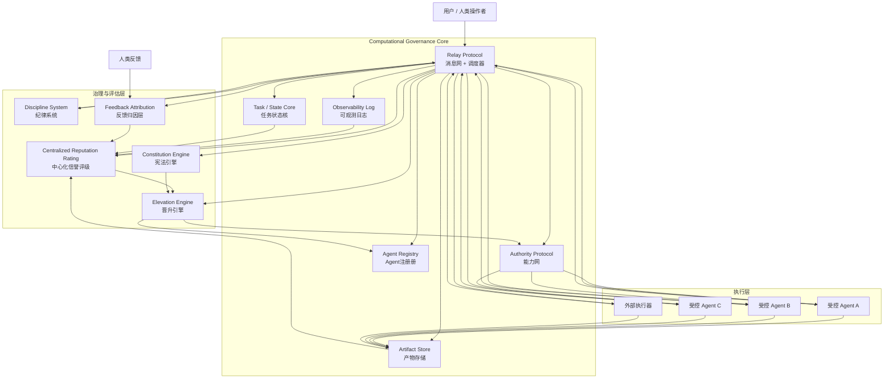

<h1 align="center">计算化Agent治理系统</h1>
Computational Governance Core，通过agent能力评级，操作权限高维投影，消息网事件驱动，实现自驱动的Agent能力分层治理，并主动清退Agent网络内的低能力Agent，保持Agent网络能力高可靠，持续交付。

| 一个以消息驱动协作、以能力投影控权、以治理反馈促演化的多 Agent 计算化治理系统。

# 一、系统定位

CGC 本质上是一个：

- 用消息网组织协作
- 用能力网定义权力边界
- 用治理层维持秩序和演化
- 用状态核与日志系统保存真相与证据

的执行内核。

它的目标不是让 Agent 自由讨论如何做事，而是：

- 让任务被稳定分派
- 让能力被按层级投影
- 让错误能被纠偏
- 让表现能被评估
- 让高层权限保持稀缺

# 二、核心原则
1. 任务走消息网

    一切任务、事件、结果、治理信号，统一经由消息网流转。

2. 能力走能力网

    Agent 不直接拥有原始工具全集，只接触能力网投影出来的能力表。

3. 长期权力由晋升体系控制

    Agent 的位阶和长期能力上限由晋升体系决定，而不是由单次任务临时决定。

4. 调度器掌握协作秩序

    调度器负责把消息转发给：

- Agent
- 能力网
- 治理模块
- 评估模块
- 日志与状态模块

但调度器不负责替代能力网络投影能力。

5. 治理是旁路，不是默认主流程

    普通任务默认单路径推进；只有达到门禁条件时，才进入纪律、上诉、晋升等治理流程。

# 三、系统总结构

系统由四层组成：

1. 协作层

    Relay Protocol（消息网，内含调度器）
2. 能力层

    Authority Protocol（能力网）
3. 治理与评估层

  - Elevation Engine（晋升引擎）
  - Discipline System（纪律系统）
  - Constitution Engine（宪法引擎）
  - Centralized Reputation Rating（中心化信誉评级）
  - Feedback Attribution（反馈归因层）

4. 基础底座层
  - Task / State Core（任务状态核）
  - Agent Registry（Agent 注册册）
  - Artifact Store（产物存储）
  - Observability Log（可观测日志）

# 四、系统拓扑图


# 五、Relay Protocol（消息网）
## 5.1 定位

消息网是系统主中枢。

它内部包含调度器，不只是消息转发层，也是任务推进层。

它负责：

- 接收用户任务
- 接收 Agent 执行结果
- 接收治理事件
- 接收能力请求消息
- 接收人类反馈消息
- 把消息转发到正确部位
- 推进任务状态

## 5.2 调度器的职责

调度器是消息网内部的控制中枢。

它负责：

1. 任务调度
- 判断下一步该哪个角色接手
- 从注册册中选择合适 Agent
- 派发 step / subtask
- 推进 stage / round / turn

2. 消息分发

把消息转发给：

- 目标 Agent
- 能力网
- 晋升引擎
- 纪律系统
- 宪法引擎
- 信誉评级
- 反馈归因
- 日志与状态核

3. 协作控制
- 接收高层 Agent 的委派提案
- 校验子任务是否合法
- 决定是否生成正式子任务
- 控制循环类流程

## 5.3 边界

消息网不负责：

- 生成 Agent 的能力表
- 长期画像评定
- 最终晋升裁决
- 纪律处罚建议内容生成

它负责的是：

让正确的信息，在正确时间，流向正确模块。

# 六、Authority Protocol（能力网）
## 6.1 定位

能力网负责维护完整能力拓扑，并向 Agent 投影能力表。

它不负责决定任务流向，但负责决定：

| 这个 Agent 在当前位阶、角色和上下文下，能触及哪些能力。

## 6.2 能力网投影逻辑

能力表由以下因素共同决定：

- Agent 当前位阶
- Agent 角色
- 当前任务阶段
- 当前 task scope
- 当前任务类型
- 长期权限状态
- 晋升引擎写回的能力上限
- 高层能力是否被临时收紧

## 6.3 投影对象

能力网向 Agent 投影的不是底层工具全集，而是：

- capability handles
- 受约束的能力句柄
- 按强弱形态裁剪后的能力接口

比如“代码修改”可能被投影成：

- code.patch.propose
- code.patch.preview
- code.patch.apply.scoped
- code.patch.apply.full

## 6.4 能力网对 Agent 的关系

能力网自己负责把能力表投影给 Agent。

也就是：

调度器告诉能力网：当前有哪些 Agent、它们处于什么任务上下文
能力网根据规则主动生成或刷新 Agent 当前能力表
Agent 在工作时参考的是能力网投影出的当前能力表

这意味着能力网更接近：

一个持续维护 Agent 能力视图的权限平面

## 6.5 能力网边界

能力网不负责：

- 选谁做任务
- 推进流程顺序
- 决定晋升
- 处理上诉

它只负责：

- 能力拓扑
- 能力上限映射
- 能力表投影
- 能力形态约束

# 七、Task / State Core（任务状态核）
## 7.1 定位

任务状态核是系统的单一真相源。

存储内容包括：

- task_id
- stage
- round
- turn
- owner
- parent_task / child_task
- 当前约束
- 当前参与者
- 当前 artifact refs
- 任务是否进入治理状态

## 7.2 作用

它保证系统不会依赖消息历史“猜当前状态”。

没有它，长流程、多 Agent 协作、高层拆解都会很快混乱。

# 八、Agent Registry（Agent 注册）
8.1 定位

注册册记录系统内所有执行体的静态和半动态信息：

- agent_id
- role
- current level
- contract type（受控 / 外部）
- status
- load
- active / frozen / retired
- 当前可接任务状态

## 8.2 作用

供调度器选人，供能力网查位阶，供晋升引擎写回层级。

# 九、Artifact Store（产物存储）
## 9.1 定位

存储所有流程产物：

- 计划
- 子任务方案
- 分析报告
- patch
- review note
- 测试结果
- 人类修正后的最终结果

##  9.2 作用

消息只传引用，不传大正文，避免消息网被上下文污染。

# 十、Observability Log（可观测日志）
## 10.1 定位

可观测日志是系统统一行为记录层。

记录内容包括：

- 消息流转
- 调度决策
- Agent 接单
- 能力表刷新
- 能力请求
- artifact 写入
- 纪律建议
- 晋升事件
- 宪法复核
- 人类反馈

## 10.2 用途

它服务于：

- 审计
- 回放
- 责任归因
- 信誉评级
- 故障定位
- 纪律门禁
- 晋升门禁

# 十一、Elevation Engine（晋升引擎）
## 11.1 定位

晋升引擎负责 Agent 的长期位阶变化。

包括：

- 晋升
- 降级
- 观察期
- 高层资格收紧
- 高层晋升窗口关闭

## 11.2 双阶段机制

晋升分两阶段：

第一阶段：硬指标门禁

例如：

- 任务完成量
- 首次通过率
- 下游破坏率
- 人类纠正率
- 纪律事件数
- 高危近失误次数

只有通过门禁，才进入下一阶段。

第二阶段：晋升委员会评级

这里可以理解为制度化评审，而不是随意讨论。
输入包括：

- 中心化信誉评级画像
- 人类反馈归因结果
- 历史治理结果
- 高层比例状态

## 11.3 动态收紧

当高层 Agent 占比达到阈值时：

- 提高门禁
- 提高评审要求
- 直接关闭晋升窗口

这保证高层权限保持稀缺。

## 11.4 写回对象

晋升引擎将结果写回消息网络，由调度器写入到能力网络

# 十二、Discipline System（纪律系统）
## 12.1 定位

纪律系统负责处理严重违规与失真行为。

它处理的不是普通失败，而是：

- 越界尝试
- 伪造结果
- 规避规则
- 高频异常行为
- 权限拼装规避

## 12.2 触发方式

由门禁触发：

- 指标门禁

例如：

- 人类纠正率过高
- 失败率异常
- 下游破坏率异常
- 风险事件密度过高
- 行为门禁

例如：

- 越 scope 请求
- 非法能力组合
- 高频绕路调用
- 伪造回执

## 12.3 输出格式

纪律系统不直接执行，而是输出固定格式建议：
```json
{
  "agent_id": "agent_x",
  "action": "freeze",
  "reason_code": "repeated_violation",
  "severity": "high",
  "suggested_duration": "7d"
}
```

然后由系统代码稳定执行。

# 十三、Constitution Engine（宪法引擎）
## 13.1 定位

宪法引擎只处理上诉与复核。

不处理日常审批。

## 13.2 适用范围

可复核：

- 晋升被拒
- 纪律建议
- 处罚过度
- 程序错误
- 关键能力限制争议

## 13.3 输出

输出：

- 维持
- 改判
- 撤销
- 发回重审

# 十四、Centralized Reputation Rating（中心化信誉评级）
## 14.1 定位

这是系统唯一的 Agent 长期画像中心。

## 14.2 它做什么

它根据多维绩效对 Agent 做画像，包括：

- completion rate
- first-pass acceptance
- rework rate
- downstream breakage
- human correction rate
- stability
- role fitness
- delegation quality
- review quality
- risk tendency

## 14.3 输入

它读取：

- 可观测日志
- 任务状态核
- artifact 结果
- 人类反馈归因
- 难度信息
- 时间窗口统计

## 14.4 输出

输出的是画像，而不是单一分：

- 长期表现
- 短期表现
- 风险倾向
- 能力成熟度
- 角色适配度
- 晋升建议参考
- 纪律关注参考

# 十五、Feedback Attribution（反馈归因层）
## 15.1 定位

这是人类反馈进入系统的转换层。

它负责把人类纠正映射成结构化责任。

## 15.2 归因维度

区分：

- 设计理解错误
- 执行错误
- 审查漏检
- 委派错误
- 外部依赖问题

并分配责任权重到具体 Agent 和阶段。

## 15.3 作用

防止多 Agent 协作中“一个任务错了，所有人一起背锅”。

# 十六、多 Agent 协作机制
## 16.1 基本机制

协作主链路如下：

1. 用户发起任务
2. 消息网接收
3. 调度器读取任务状态核和注册册
4. 派发给合适的规划 Agent
5. 规划Agent拆分任务包，并下发到执行层Agent
6. 能力网按该 Agent 当前上下文投影能力表
7. Agent 执行并回传结果到消息网
8. 结果写入产物存储和可观测日志
9. 调度器推进下一步

## 16.2 高层拆解

高层 Agent 可以：

- 理解复杂任务
- 生成子任务方案
- 标注子任务目标、角色需求和能力预算建议

然后把子任务提案发回消息网。

由调度器决定：

- 是否接受该拆解
- 如何正式下派
- 哪个下级 Agent 接手

## 16.3 成功率衡量

多 Agent 场景下，不按整个任务直接给人加减分。
而是按：

- step 完成
- 首次通过
- 返工
- 下游破坏
- 人类反馈纠正
- 责任归因
- 难度修正

进行长期画像。

# 十七、外部执行器
## 17.1 定位

外部自治 Agent 仍不属于系统正式公民。

它属于：

- 外部执行器
- 黑盒高能力服务
- 特种执行能力节点

## 17.2 接入方式

由消息网调用，由能力网不直接投影其内部能力。

系统只能控制：

- 输入
- 环境
- 输出接纳
- 日志记录

# 十八、系统调用模型

## 18.1 任务消息

统一发到消息网，由调度器转发。

## 18.2 能力表

不是 Agent 临时每次申请后由消息网审批单次生成，而是：

由能力网持续投影给 Agent。

## 18.3 能力调用

Agent 在其当前能力表范围内工作；当上下文变化时，能力网刷新其能力表。

也就是说：

消息网负责“任务和事件的流转”
能力网负责“能力表的维护和投影”

这两者分工清楚。

# 十九、定时治理机制

由定时任务负责触发：

- 晋升窗口
- 高层比例检查
- 门禁阈值更新
- 长期表现回收
- 纪律候选扫描
